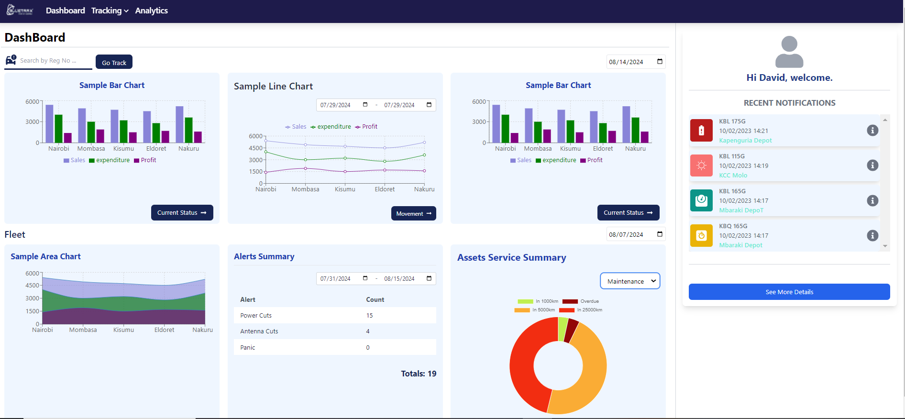
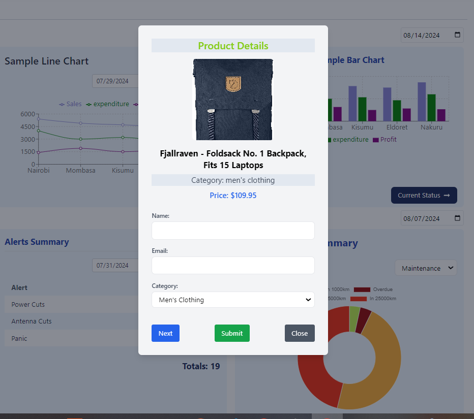
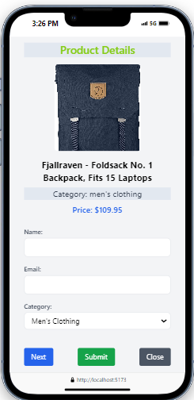

# RiverCross_Dashboard
- Implementing a given design using React and Tailwind.
## API used:
- fakestoreapi. You can explore it here: https://fakestoreapi.com/
## Libraries utilized
- axios
- Recharts. Explore it here: https://recharts.org/en-US/guide
- React Chartjs-2. Explore it here: https://www.npmjs.com/package/react-chartjs-2
## Deployment:
- Vercel
### Screenshots:

